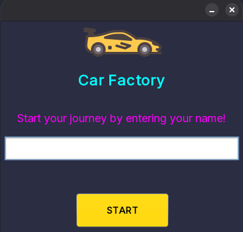
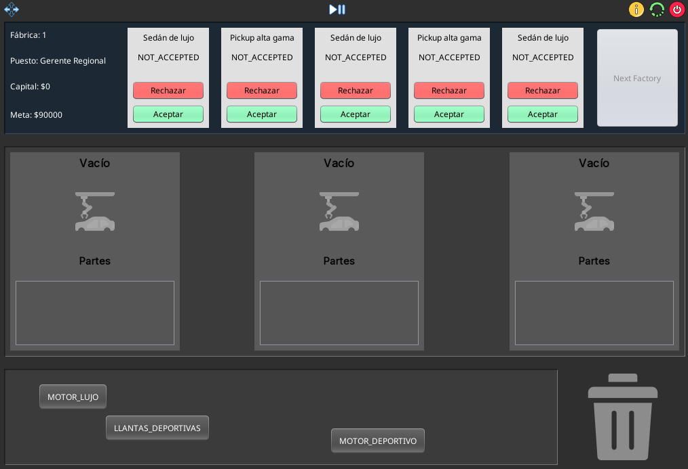

# CarFactoryFide 🚗🏭

A Java desktop simulation game where you manage a car factory, assemble vehicles, handle materials, and fulfill production orders. Built with Java Swing (NetBeans GUI Builder) and a modular OOP architecture.

---

## 📸 Preview






---

---

## 🎮 Game Overview

- **Assembly cars** by managing materials on conveyor belts and the assembly line.
- **Fulfill customer orders** with different requirements and car types.
- **Control production** with intuitive panels and real-time status updates.
- **Challenge:** Optimize your factory flow to meet deadlines and maximize efficiency.
- **All data is in-memory** (custom LinkedLists, Queues — no external DB).

---

## 📂 Project Structure

```
src/
├── app/                # Entry point (Main.java)
├── controller/         # Game controller logic
├── images/             # Game icons and graphics (PNG)
├── model/              # Core entities: Car, Material, Factory, Order, Player, etc.
│   ├── enums/          # Types for Car, Material, and OrderStatus
│   └── structure/      # Custom LinkedList and Queue implementations
├── music/              # Sound assets (WAV)
├── util/               # Utilities (Colors, GenerateMaterials)
└── view/               # Java Swing UI (forms, panels, dialogs)
    └── panel/          # Sub-panels for assembly line, conveyor, hub, etc.
```

---

## 🛠️ How to Run

### 1. **Clone the Repository**

```sh
git clone https://github.com/Sojo506/carFactoryFide.git
cd carFactoryFide
```

### 2. **Open with NetBeans (Recommended)**

- Use NetBeans IDE to open the project and access visual form editing.
- Run `src/app/Main.java` to launch the game.

### 3. **Or Compile & Run from Terminal**

```sh
javac -d build src/**/*.java
java -cp build app.Main
```

*Note: Java 8+ required.*

---

## 🕹️ Gameplay Modules

- **MainView:** Central dashboard and navigation.
- **StartGameView:** Start screen and new game setup.
- **Panels (view/panel):**
  - `AssemblyPanel` — Car assembly line UI.
  - `ConveyorBeltPanel` — Material management and conveyor logic.
  - `HubPanel` — Factory hub and controls.
- **Dialogs:** Info/help pop-ups during gameplay.

---

## 🧩 Core Components

| Module          | Description                                     |
|-----------------|-------------------------------------------------|
| `GameController`| Handles main game logic, state & event control  |
| `Factory`       | Factory simulation (materials, orders, workers) |
| `Order`         | Represents car production requests              |
| `AssemblyLine`  | Simulates assembly line operations              |
| `Car`, `Material`| Core objects for the factory                   |
| `Player`        | Tracks user/game state                          |
| `LinkedList`, `Queue` | Custom data structures                    |

---

## 🎨 Assets

- PNG images for UI/UX: `/src/images/`
- Soundtrack: `/src/music/gamecarmusic.Wav`

---

## 👨‍💻 Technologies

- **Java SE 8+**
- **Swing/NetBeans GUI Builder** (visual `.form` files)
- **Custom data structures:** No Java Collections used in core logic.

---

## 🤔 How It Works

- Players start the game from the `StartGameView`.
- Use drag-and-drop panels to move materials to the assembly line.
- Complete orders shown in the UI before the timer runs out.
- The `GameController` manages game flow, scoring, and events.
- All progress is lost when the game closes (no DB or save).

---

## 🚀 Customization & Extension

- Add new car/material types via `model/enums/`.
- Change icons or sound in `images/` and `music/`.
- Extend gameplay logic in `controller/GameController.java`.

---

## 📋 Credits

Developed by Sojo506 & contributors as a university project.

---

## 📄 License

Educational use only. For other uses, contact the maintainer.
